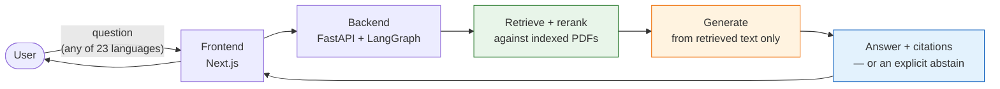
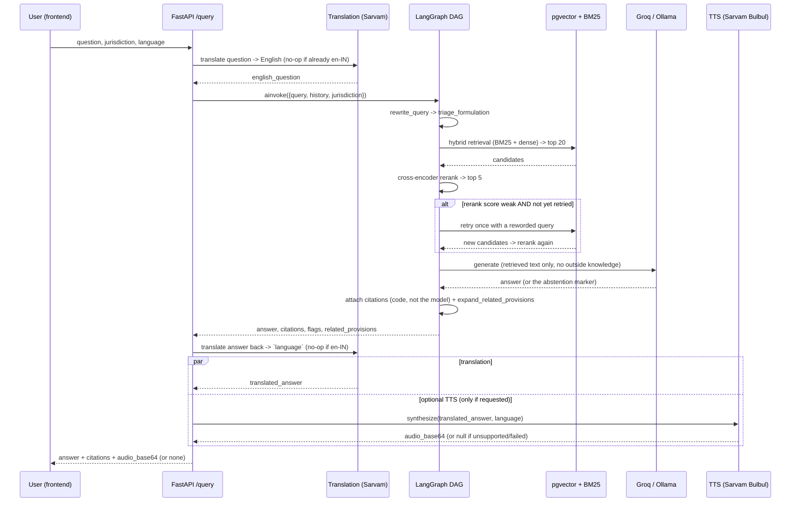
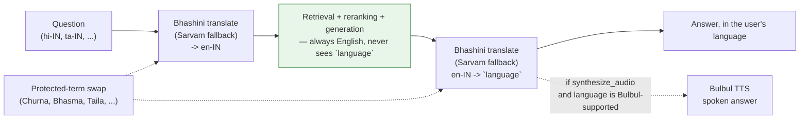
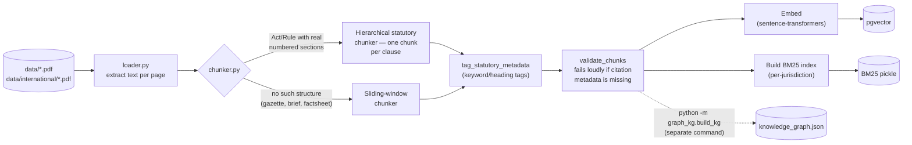
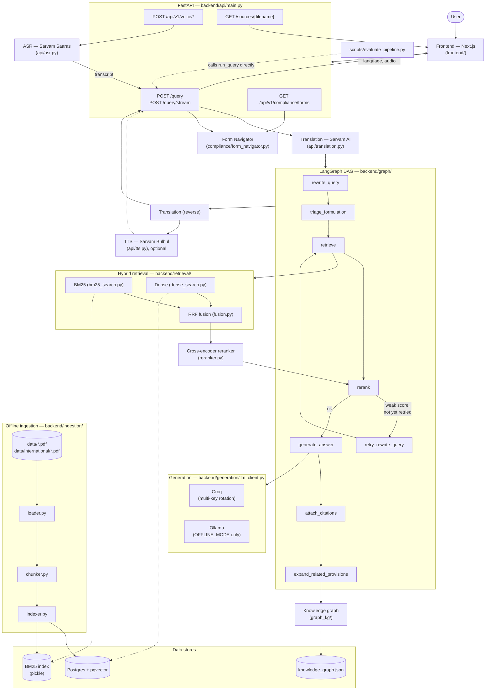

# IP-SAKTI Sahayak

Smart India Hackathon 2026, problem statement **SIH26045**, Ministry of Ayush.

IP-SAKTI Sahayak is a source-cited AI assistant for questions about
Intellectual Property and regulatory rules relevant to Ayurveda in India. A
user asks a question; the system retrieves relevant text from a fixed set of
official government documents and answers using only that text, showing
which document, page, and section each part of the answer came from. If the
answer isn't in the indexed documents, it says so instead of guessing.

Scope covers both the national (Indian) IP/regulatory framework and, via an
explicit jurisdiction toggle, international treaty regimes (WIPO GRATK
Treaty, Nagoya Protocol, Budapest Treaty, PCT) — kept as two visibly
separate answer-sets, never conflated (see `data/international/README.md`
for exactly what's indexed).

## Why the architecture is what it is

Independent evaluations of commercial legal AI tools found hallucination
rates of 17–33% even with retrieval-augmented generation in place. In a
regulatory domain, a confidently wrong answer is worse than no answer. Four
decisions follow from that — full reasoning is in [idea.md](idea.md):

1. **Hybrid retrieval** (BM25 + dense embeddings, fused by Reciprocal Rank
   Fusion) instead of dense-only, because legal text needs exact matching on
   section numbers and statutory terms, not just semantic similarity.
2. **Cross-encoder reranking** to re-score candidates for actual relevance
   before anything reaches the LLM.
3. **Programmatic citations** — the LLM never writes a citation. The code
   tracks which chunks were actually retrieved and attaches their source
   file, page, and section directly. A citation cannot be hallucinated if the
   model never generates it.
4. **Abstention guardrail** — if the retrieved context doesn't contain the
   answer, the system says so explicitly and asks a clarifying question,
   rather than filling the gap from the model's general knowledge.

Orchestration is a **deterministic LangGraph DAG**, not an autonomous agent
loop — a fixed sequence of nodes with one bounded conditional retry, not
unbounded cycles.

## Pipeline

```
User query
  → Query rewriter        (standalone question, using chat history if any)
  → Hybrid retrieval       BM25 + dense embeddings, merged by RRF   → top 20
  → Cross-encoder reranker                                          → top 5
  → Grounded generation    (LLM, retrieved text only, no outside knowledge)
  → Citation attacher      (code-attached from retrieved chunks, not the LLM)
  → Answer + sources   —or—   Abstains, with one clarifying question
```

One bounded exception to the straight-line flow: if the top rerank score is
weak, the graph retries retrieval once with a reworded query before giving
up and generating an answer (or abstaining). Never more than one retry.

## Architecture

Four views of the same system, from a 10-second glance to full file-level
detail. See `docs/PROJECT_REPORT.md` for what every box in the detailed
diagram actually is, file by file.

### Simple overview

The shape everything else in this section elaborates on: one question in,
one grounded answer with real citations out — or an explicit "not in my
sources" instead of a guess.



### Request flow — what happens during one `/query` call

Sequence, not structure: the actual order of operations, including the one
conditional retry and the concurrency between translation and TTS.



### Multilingual flow — why retrieval only ever sees English

The single design decision that makes 23-language support tractable:
translation happens only at the two edges, never inside retrieval or the
prompt.



`en-IN` (the default) skips both translation calls entirely — zero added
latency, identical behavior to a language-unaware system. A fixed lexicon
of Ayurvedic terms (Churna, Bhasma, Taila, Kwatha, Rasa Shastra, Asava,
Arishta) is swapped for an opaque placeholder before every translate call
and restored after, so neither Bhashini nor Sarvam mistranslates or transliterates a term
this project's corpus depends on into an approximate gloss.

### Offline ingestion flow — how the corpus becomes queryable

Runs once per corpus change (`python -m ingestion.indexer --reset`), never
per request.



### Detailed architecture — every module, client through storage



## Testing

All commands below are run from `backend/`, with the venv active.

**Automated suite** (63 tests, run against the real live pipeline — real
DB, real embeddings, real Groq calls, not mocks, except `test_asr.py`
which mocks Sarvam deliberately since it's testing this repo's own
request handling, not Sarvam's transcription accuracy):
```bash
python -m pytest -v
```
Covers: retrieval determinism (bit-identical BM25/dense/rerank scores
across repeated runs), the formulation classifier, statutory-tag
classification, translation term-protection (Ayurvedic terms survive a
real Sarvam round-trip), API-contract drift (`QueryRequest`/
`QueryResponse`'s real Pydantic fields must match a hand-maintained set,
so an undocumented field change fails immediately), the knowledge graph,
the form navigator (including a live regression test against `run_query()`
for the exact false-positive bug `scripts/evaluate_pipeline.py` caught),
ASR, and the `/sources/{filename}` endpoint (including path-traversal
rejection).

**Offline evaluation harness** — proves accuracy against a curated
20-query ground-truth set (`data/eval_benchmark.json`: 5 domestic Section
3(p) queries, 5 Biological Diversity Act/NBA compliance queries, 5
international-treaty queries, 5 out-of-scope hallucination traps), run
through the exact same `run_query()` function `/query` itself calls:
```bash
python scripts/evaluate_pipeline.py
```
Prints a formatted table (per-query citation match / abstention pass /
latency) and overall metrics (statutory accuracy, false-positive
abstention rate, abstention faithfulness, mean latency), and writes the
full result set to `backend/eval_report.json`. Takes several minutes (20
real LLM calls) and consumes real Groq quota — this is what the multi-key
rotation in `generation/llm_client.py` exists for for. Not a pass/fail
gate: several queries are deliberately realistic tests of whether
retrieval generalizes past exact statute phrasing, not softballs, so
less-than-100% is expected and informative, not a bug to hide.

**Manual smoke test of one module at a time**, useful when debugging a
specific layer:
```bash
python -m retrieval "Section 3(p) traditional knowledge"     # BM25/dense/fused/reranked, side by side
python -m generation "What does Section 3(p) say...?"        # retrieval → LLM → answer + citations
python -m graph "What does Section 3(p) say...?"              # the full pipeline, no HTTP layer
python -m api.asr path/to/audio.wav                            # speech-to-text alone
python -m compliance.form_navigator "patent my formulation"    # form matching alone
python -m graph_kg.kg Patents_Act_Sec3p                         # knowledge-graph lookup alone
```

**Frontend** — no automated test suite yet; verify manually:
```bash
cd frontend
npx tsc --noEmit   # type-check
npm run build      # production build
npm run lint       # eslint
```
Then run both servers (see Setup below) and exercise the UI directly:
ask a question that should answer (e.g. "What does Section 3(p) say about
traditional knowledge?"), one that should abstain (e.g. "What's the
capital of France?"), and click a citation's "View source PDF" link to
confirm it opens the real PDF at the right page.

## Tech stack

| Layer | Choice |
|---|---|
| Orchestration | LangGraph (deterministic DAG) |
| API | FastAPI |
| Sparse retrieval | rank_bm25 (BM25Okapi) |
| Dense retrieval | sentence-transformers, `all-MiniLM-L6-v2` (384 dims) |
| Vector store | pgvector on Postgres (Neon, in this deployment) |
| Reranker | cross-encoder, `ms-marco-MiniLM-L-6-v2`, run locally |
| LLM primary | Groq API — direct, no local-first guessing on the live path |
| LLM offline fallback | Ollama (local), gated behind `OFFLINE_MODE=true` — an explicit operator flag, not tried automatically per-request (see `idea.md` for why that changed) |
| Translation | Bhashini (MeitY) primary, Sarvam automatic fallback — question in, answer out, wired into `/query` (not `/query/stream`) |
| Frontend | Next.js/React, `frontend/` — a chat UI against `docs/API_CONTRACT.md` (see Current status) |

## Repo layout

```
├── idea.md                 Standing project context / architecture rationale
├── PROJECT_GUIDE.md        Original team build plan
├── README.md               This file
├── docs/
│   └── API_CONTRACT.md    Backend HTTP interface, for frontend integration
├── data/                   Source PDFs (gitignored — see Document corpus)
│   └── international/      6 real international documents indexed — see its README
├── backend/
│   ├── ingestion/          loader.py, chunker.py (hierarchical statutory chunking), indexer.py
│   ├── retrieval/          bm25_search.py, dense_search.py, fusion.py, reranker.py
│   ├── generation/         prompts.py, llm_client.py (multi-key Groq rotation), citation.py
│   ├── graph/              state.py, nodes.py, build_graph.py, formulation.py
│   ├── graph_kg/           build_kg.py, kg.py — knowledge-graph cross-references
│   ├── compliance/         form_navigator.py — NBA/IPO form catalog
│   ├── api/                main.py, asr.py, translation.py, tts.py, text_chunking.py
│   ├── scripts/            evaluate_pipeline.py — offline benchmark harness
│   ├── tests/              pytest suite — retrieval determinism, translation, API contract, ASR, forms, KG
│   ├── run.py              actual entrypoint on Windows — see API_CONTRACT.md
│   ├── Procfile
│   ├── requirements.txt
│   └── env.example.txt
└── frontend/               Next.js chat UI — see its own README for setup
```

## Setup

```bash
git clone https://github.com/01-Aadarsh/SIH-FINAL.git
cd SIH-FINAL/backend

python -m venv .venv
.venv\Scripts\activate          # Windows; `source .venv/bin/activate` on Mac/Linux
pip install -r requirements.txt

cp env.example.txt .env
```

Fill in `.env`:
- `DATABASE_URL` — a Postgres connection string with the `pgvector` extension
  available (a free Neon or Supabase project works). The indexer runs
  `CREATE EXTENSION IF NOT EXISTS vector;` itself on first connect; if your
  provider restricts that for app-level connections, run it once yourself in
  their SQL editor.
- `GROQ_API_KEY` — free tier at [console.groq.com](https://console.groq.com).
  **Check `GROQ_MODEL` against your own key's access** — model availability
  varies by account; `client.models.list()` shows what's actually usable.
  `openai/gpt-oss-120b` is confirmed working as of this writing.
- Everything else has a working default — see `env.example.txt` for what
  each variable does.

Put source PDFs in `data/` at the repo root (sibling of `backend/`, not
inside it). Filenames matter: they're shown to the user as the citation
source, so name them for what they are (`GI_Act_1999.pdf`, not `doc1.pdf`).

Then, from `backend/`:
```bash
python -m ingestion.indexer --reset
python -m graph_kg.build_kg
```
The first command loads every PDF in `data/`, chunks it, embeds it into
pgvector, and builds the BM25 index. It fails loudly (not silently) if any
chunk is missing citation metadata — that's deliberate, since every
downstream citation depends on it. The second builds the small knowledge
graph over the corpus's own statutory tags that powers `related_provisions`
(see `backend/graph_kg/`) — re-run it any time after re-running the
indexer, since it reads the same `statutory_tags` the indexer just wrote.

## Running things

All commands below are run from `backend/`, with the venv active.

**Test retrieval alone** (prints BM25 / dense / fused / reranked results
side by side for one query):
```bash
python -m retrieval "Section 3(p) traditional knowledge"
```

**Test generation end to end** (retrieval → LLM → answer + citations,
printed to the terminal):
```bash
python -m generation "What does Section 3(p) say about traditional knowledge?"
```

**Run the full LangGraph pipeline** directly (same result as `/query`, no
HTTP layer):
```bash
python -m graph "What does Section 3(p) say about traditional knowledge?"
```

**Run the API:**
```bash
python run.py
```
**On Windows, use `python run.py`, not a bare `uvicorn api.main:app`** —
`uvicorn` creates its event loop before importing the app, which breaks
psycopg's async mode under Windows' default event loop. `run.py` fixes
this before anything else is imported. `uvicorn api.main:app --reload`
still works for hot-reload dev on Linux/macOS, where this doesn't apply.

Then `GET /health`, `POST /auth/login`, `POST /auth/register`, `GET /auth/me`,
`POST /query`, `POST /query/stream`, `POST /ingest`,
`GET /sources/{filename}`, `POST /api/v1/voice/transcribe`,
`POST /api/v1/voice/query`, `GET /api/v1/compliance/forms`. Full request/
response shapes, real example responses, and timing expectations are in
[docs/API_CONTRACT.md](docs/API_CONTRACT.md) — that's the source of truth
for frontend integration, not this file.

**Frontend**, from `frontend/` (needs the backend already running per above):
```bash
cd frontend
npm install
cp .env.local.example .env.local   # defaults to http://127.0.0.1:8000, matching the backend's default port
npm run dev
```
Then open `http://localhost:3000`. `NEXT_PUBLIC_API_BASE_URL` in
`.env.local` is the only thing to change if the backend isn't on its
default port/host.

### Log in (demo)

The marketing page and intake **Account** rail call the backend auth API
(`POST /auth/login`, `POST /auth/register`). Start the backend first, then:

| Field | Value |
|---|---|
| Mobile | `9876543210` (or `DEMO_LOGIN_PHONE`) |
| Password | `demo123` (or `DEMO_LOGIN_PASSWORD`) |

You can also sign up with a new email/mobile. **Continue to Chat** and
**Skip to Chat** do not require login. Override secrets via `AUTH_SECRET`
and the `DEMO_LOGIN_*` variables in `backend/env.example.txt` (copy to
`.env` locally — never commit).

### Run with Docker

From this directory (`iam/sih-2026`):

```bash
docker compose up --build
```

- Frontend: http://localhost:3000  
- Backend API: http://localhost:8000 (`GET /health`, `POST /auth/login`)  
- Postgres+pgvector: localhost:5432 (`ipsakti` / `ipsakti`)

Copy `backend/env.example.txt` to `backend/.env` and add `GROQ_API_KEY` (and
any Bhashini/Sarvam keys) before running queries — auth works without them.
After the stack is up, run ingestion once inside the backend container if
the vector index is empty (see backend README).

```bash
docker compose exec backend python -m ingestion.indexer
```

## Demo

`docs/DEMO_QUERIES.md` — 7 questions verified live against the running
backend (6 that answer well across different statutes/jurisdictions/
languages, 1 deliberately out-of-scope one that should abstain), with
expected confidence/citation counts and talking points for each. Use that
list rather than improvising questions live — small rephrasing can change
the retrieval score (BM25 is exact-token matching), so an unverified
question risks a weaker answer than the system is actually capable of.

## Current status

**Done:**
- Ingestion — PDF loading, hierarchical statutory chunking (each Act
  section/clause is its own citable chunk, not a slice of a fixed-size
  window) with best-effort statutory tagging, dual indexing into pgvector
  + BM25 (jurisdiction-partitioned)
- Hybrid retrieval (BM25 + dense, fused by RRF) with a calibrated
  cross-encoder reranker
- Grounded generation with programmatic citation attachment and a verified
  abstention guardrail
- Deterministic formulation-category triage (classical / proprietary /
  phytopharmaceutical / Ayurveda-Aahar / cosmetic), keyword-based, with
  genuine-ambiguity clarification detection
- LangGraph DAG wiring the above into one async pipeline, with a bounded
  single retry on weak retrieval
- Multilingual — Bhashini (MeitY) with Sarvam fallback, question
  translated to English before retrieval, answer translated back after
  generation (`/query` only)
- Text-to-speech — Sarvam's Bulbul model, opt-in via
  `QueryRequest.synthesize_audio`, speaks the *translated* answer in 11 of
  the languages translation supports (see
  `backend/api/tts.py::BULBUL_SUPPORTED_LANGUAGES`) — not English-only,
  and needs no manual model-terms approval (an earlier Groq-based
  implementation required both; see `idea.md`)
- International-jurisdiction documents — WIPO GRATK Treaty (2024), Nagoya
  Protocol, Budapest Treaty (full text + WIPO's own secretariat note), PCT
  full text, and a WIPO IGC mandate decision, all real source documents,
  verified by content — see `data/international/README.md`
- FastAPI layer: `/query`, `/query/stream` (SSE token streaming),
  `/health`, `/ingest` — see `docs/API_CONTRACT.md` for the full, current
  contract (this file is not the source of truth for API shape)
- Automated test suite (`backend/tests/`) covering retrieval determinism,
  translation correctness, and API-contract drift, run against the real
  live pipeline, not mocks
- Knowledge graph — first real slice (`backend/graph_kg/`): a graph over
  the corpus's own statutory tags, with data-derived co-occurrence edges
  plus a small, explicitly reviewed cross-jurisdiction cross-reference
  table (e.g. a domestic Section 3(p) question surfacing the WIPO GRATK
  Treaty's disclosure obligation as a real, separately-citable pointer).
  Surfaced as `related_provisions` on both `/query` and `/query/stream`.
  Deterministic, no LLM call — see `graph_kg/build_kg.py` for exactly
  which edges are data-derived versus authored, and why
- Speech-to-text — Sarvam's Saaras model (`backend/api/asr.py`),
  `POST /api/v1/voice/transcribe` and the composite
  `POST /api/v1/voice/query` (audio in, transcribed, piped through the
  same pipeline `/query` uses, full response out)
- Form & Registry Navigator (`backend/compliance/form_navigator.py`) —
  matches a question to the real NBA/IPO form it needs next (form
  numbers verified against the actual indexed Biological Diversity Rules,
  2024 text, not assumed), surfaced as `actionable_forms` on `/query`
  and via `GET /api/v1/compliance/forms` — each matched form is also
  downloadable as a fillable .docx prep checklist
  (`backend/compliance/form_generator.py`,
  `GET /api/v1/compliance/forms/{form_id}/download`), built only from
  that same catalog's real fields (title, statutory mandate, portal,
  attachments, deadline) — never an invented fee or field
- Compliance-checkpoint flags (`backend/generation/compliance_flags.py`)
  — deterministic, generic pointers at compliance checkpoints the
  *actually cited* chunks touch (e.g. Section 3(p), NBA approval, TKDL),
  surfaced as `compliance_flags` on `/query` and `/query/stream`.
  Deliberately never asserts a fee/timeline/percentage not already in the
  cited text — see its module docstring for the fabricated-facts draft
  this replaced
- Startup warm-up (`backend/api/main.py`'s `lifespan` handler) — the
  embedding model, cross-encoder, LangGraph, and one DB connection are
  all forced to load at process startup rather than lazily on whoever's
  first request happens to land. Fixes a real, reproduced symptom: the
  first query after a cold start used to pay for both model-loading
  latency and a transient DNS hiccup in `ingestion/indexer.py::
  connect_async` (Windows-specific asyncio behavior — see that function's
  docstring), occasionally failing outright with a retry succeeding right
  after. Verified: first request post-restart now completes in ~9s (pure
  LLM latency), not a failure
- Offline evaluation harness (`backend/scripts/evaluate_pipeline.py` +
  `data/eval_benchmark.json`) — runs curated queries against the live
  pipeline, reports citation precision, abstention faithfulness, and
  latency, for demonstrating accuracy to evaluators
- Multi-key Groq rotation (`backend/generation/llm_client.py`) —
  `GROQ_API_KEY_2`, `GROQ_API_KEY_3`, ... are tried automatically on a
  429 (daily quota exhausted on the current key), a real failure mode
  hit during this project's own benchmark runs
- Frontend (`frontend/`) — Aadarsh neu-morphic Next.js UI on this backend:
  home + intake, jurisdiction toggle (`india` / `international`), streaming
  chat, citation cards linking to the real source PDF (`GET /sources/{filename}`),
  confidence/weak-grounding, related-provisions and actionable-forms panels,
  ABS/TKDL helper, human-facilitator mailto, multilingual Bhashini/Sarvam
  `language`, optional Bulbul TTS when voice mode is on,
  abstention banner

**Not yet built:**
- Deployment — everything above has only been run locally so far
  (`backend/Procfile` exists for Render/Railway, unused so far)
- Agentic multi-source orchestration — the knowledge graph above is a
  deterministic lookup layer, not an agent that decides what to query
  next; genuine multi-step agentic reasoning over the graph is still open

**LLM backend, current architecture (changed since this file was first
written):** Groq is the direct primary path now — no local-first guessing
on every request. Local Ollama is still available for a venue-WiFi-fails
scenario, gated behind an explicit `OFFLINE_MODE=true` flag in the
backend's `.env`, not tried automatically. See `idea.md` for why this
flipped from the original Ollama-primary design (short version: Ollama's
GPU path crashes on the dev machine this was built on, forcing slow
CPU-only inference that was costing every request real, measured delay
before ever reaching Groq).

## Document corpus

The system can only answer from what's actually indexed — and what's
indexed changes as the corpus grows, so this file doesn't hand-maintain a
copy of that list (it did once; it went stale). The authoritative list is
always:
```bash
ls data/*.pdf
```
or, for chunk counts per document, the output of the last
`python -m ingestion.indexer` run (also queryable directly: `SELECT
source_file, COUNT(*) FROM chunks GROUP BY source_file;`).

Questions outside what's actually indexed — a `jurisdiction: "international"`
question about a treaty genuinely not in `data/international/` (e.g. the
substantive IGC negotiating-history documents, not yet added — see that
folder's README), or anything unrelated to Indian IP/Ayurveda regulation —
are expected to trigger the abstention guardrail, not a guessed answer.
That's the intended behavior, not a gap to route around.
