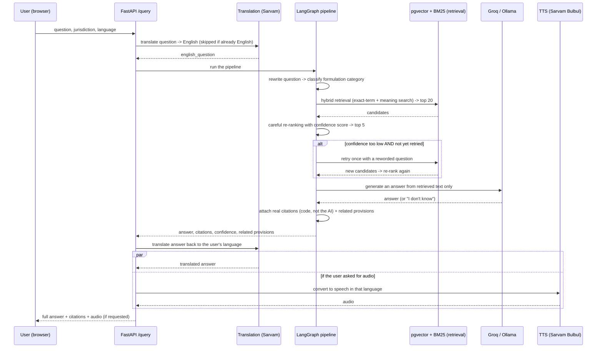
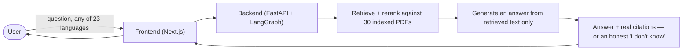
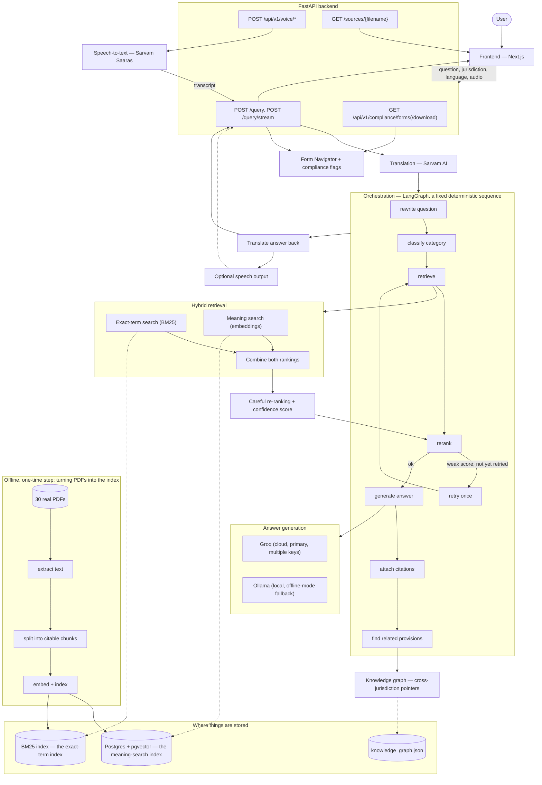

# IP-SAKTI Sahayak — Complete Project Report & Question Bank

Smart India Hackathon 2026, problem statement **SIH26045**, Ministry of
AYUSH. This one document is meant to answer *everything* — what the
project is, why it exists, exactly how it works end to end, the full
system architecture, and every question a judge (technical or
non-technical) is likely to ask, with a straight answer to each. No prior
knowledge of the codebase is assumed anywhere in this file.

For the file-by-file developer map, see `git log` and the inline
docstrings — this document explains the *system*, not every line of code.
For the exact HTTP contract, see [`API_CONTRACT.md`](API_CONTRACT.md).
For architecture rationale in the original author's own words, see
[`idea.md`](../idea.md).

---

## Table of contents

1. [The problem, explained simply](#1-the-problem-explained-simply)
2. [What IP-SAKTI Sahayak actually is](#2-what-ip-sakti-sahayak-actually-is)
3. [Everything the product can do](#3-everything-the-product-can-do)
4. [The full flow of one question, start to finish](#4-the-full-flow-of-one-question-start-to-finish)
5. [System architecture](#5-system-architecture)
6. [The technology stack, and why each piece](#6-the-technology-stack-and-why-each-piece)
7. [Why it's built this way — the core design philosophy](#7-why-its-built-this-way--the-core-design-philosophy)
8. [What's new in the latest round of work](#8-whats-new-in-the-latest-round-of-work)
9. [Honest limitations — what this is not](#9-honest-limitations--what-this-is-not)
10. [The demo script](#10-the-demo-script)
11. [Question bank — technical judges](#11-question-bank--technical-judges)
12. [Question bank — non-technical judges](#12-question-bank--non-technical-judges)
13. [Quick reference](#13-quick-reference)

---

## 1. The problem, explained simply

### What is Ayurveda, and why does it need an IP tool at all?

Ayurveda is India's traditional medicine system — thousands of years old,
built around herbs, minerals, and combinations of them ("formulations")
to treat illness. Things like **Triphala** (three fruits, used for
digestion), a **turmeric paste** for wounds, or **Ashwagandha** root
powder for stress are classical formulations, written down and used for
generations in texts like the *Charaka Samhita*.

India's Ayurveda sector is a real, fast-growing industry — companies want
to commercialize new products, get patents, get regulatory approval, and
sometimes sell internationally. Every one of those steps runs into
intellectual-property (IP) and regulatory law, and that law has some very
specific, very easy-to-get-wrong traps.

### Trap 1 — "Section 3(p)": you cannot patent what's already known

A patent is a government-granted monopoly: invent something genuinely
new, and the government lets you be the only one who can sell it for a
period of time, in exchange for publicly describing how it works.

**You cannot patent something that already exists and is already known.**
India's Patents Act, 1970, **Section 3(p)**, says an invention that is
"in effect, traditional knowledge" is not a real invention, and therefore
not patentable. That's deliberate: if Triphala churna has been used by
millions of people for centuries, nobody should be able to walk in
tomorrow and claim a monopoly on it.

The hard part for a real Ayurvedic startup: knowing exactly where the
line is between "this is just the old recipe" (protected as traditional
knowledge, not patentable) and "this is a genuinely new invention built
on top of the old recipe" (patentable). Getting this wrong wastes months
and money, or worse, leads a company to believe it owns a monopoly it
never legally had.

### Trap 2 — the Biological Diversity Act: you may need approval before you even file

Separately, the **Biological Diversity Act, 2002** (updated by a 2023
Amendment and 2024 Rules) protects India's biological resources — plants,
microbes, genetic material — from being used commercially or patented
without permission. If a product uses an Indian biological resource and
the company wants to sell it commercially or patent it (in India or
abroad), it may need **prior approval from the National Biodiversity
Authority (NBA)** — a real, government-mandated step, not a formality.
There isn't one form for this either — different situations (research
access, commercial use, patent filing) need different NBA forms, and
picking the wrong one, or not knowing one's needed, is an easy and
expensive mistake.

### Trap 3 — international expansion multiplies the problem

The moment a company looks past India — filing an international patent,
exporting a product — a *second* layer of rules kicks in: the WIPO GRATK
Treaty's mandatory disclosure-of-origin requirement, the Nagoya
Protocol's access-and-benefit-sharing obligations, the Budapest Treaty's
microorganism-deposit rules, PCT filing procedure. Getting India right
and getting international wrong is just as costly as getting either one
wrong alone.

### Why a normal AI chatbot is dangerous here

Ask ChatGPT (or any general-purpose AI) "can I patent Triphala churna?"
and it will sound confident — but general AI models learn patterns from
huge amounts of internet text, not a live connection to the actual
current law. They invent section numbers that don't exist, cite repealed
law, or blend Indian and foreign law without saying so. This isn't rare:
independent studies of commercial "AI legal assistant" tools found a
confidently wrong answer **17–33% of the time**, even with document
retrieval already in place.

For a hobby chatbot, a wrong answer is embarrassing. For someone deciding
whether to spend months and real money filing a patent, **a confidently
wrong answer is worse than no answer at all**. This is exactly the
problem IP-SAKTI Sahayak exists to solve.

---

## 2. What IP-SAKTI Sahayak actually is

**IP-SAKTI Sahayak** ("Sahayak" = helper/assistant in Hindi) is a
source-cited AI assistant for Ayurveda-related intellectual property and
regulatory questions, built for SIH26045 under the Ministry of AYUSH.

**In one sentence**: a user asks a question, in any of 23 languages, by
typing or speaking; the system searches a fixed set of 30 real government
and treaty documents, and answers *using only what those documents
actually say* — with a citation to the exact document, page, and section
behind every claim — or says plainly "I don't know" instead of guessing.

**What it is not**: it is not a lawyer, it does not give legal advice, and
it does not have opinions of its own. Every response ends with a
disclaimer saying exactly that. It is a fast, honest way to find out what
the actual indexed law says about a question — a research and navigation
tool, not a decision-maker.

---

## 3. Everything the product can do

| Capability | Plain-language description |
|---|---|
| **Grounded question answering** | Ask any Ayurveda IP/regulatory question in text; get an answer built only from real retrieved document text, never from the model's general knowledge. |
| **Programmatic citations** | Every answer lists the exact document, page number, and section it came from — attached by code from the chunks actually retrieved, never written or guessed by the AI model. Click "View source PDF" to see the exact page, with the exact retrieved passage quoted right above it. |
| **Honest abstention** | If the indexed documents genuinely don't answer the question, the system says so explicitly and asks a clarifying question — instead of inventing a plausible-sounding but false answer. |
| **India ↔ International jurisdiction switch** | Toggle between the domestic Indian framework and the international treaty framework (WIPO GRATK Treaty, Nagoya Protocol, Budapest Treaty, PCT). The two answer-sets are kept completely separate — an India question never accidentally cites an international treaty as if it were Indian law, and vice versa. |
| **Cross-jurisdiction knowledge graph** | Even while answering strictly within one jurisdiction, the system can point at a *related* provision in the other jurisdiction — e.g. an India-only NBA-approval answer also surfaces "the Nagoya Protocol has an international counterpart to this" as a separate, clearly-labeled pointer, not blended into the main answer. |
| **Full multilingual support — now actually working end to end** | Ask in Hindi, Marathi, Tamil, Telugu, Bengali, Gujarati, Kannada, Malayalam, Punjabi, Odia, or English; get the answer back in that same language. (See [Section 8](#8-whats-new-in-the-latest-round-of-work) — this was recently fixed; the UI control existed before but wasn't actually connected to the backend.) |
| **Voice in, voice out** | Ask by speaking into the microphone (speech-to-text via Sarvam's Saaras model); optionally have the answer read aloud (text-to-speech via Sarvam's Bulbul model), in the same language as the question. |
| **Formulation triage** | The question is automatically, deterministically classified into one of six Ayurveda product categories (classical, proprietary, phytopharmaceutical, Ayurveda-Aahar/nutraceutical, cosmetic, new/non-classical drug) to frame the answer correctly — no separate input needed. |
| **Actionable government forms** | The system matches a question to the real NBA/IPO forms it implies the user needs next — with the correct form number, statutory basis, submission portal, required attachments, and deadline. |
| **Downloadable form prep checklist** | Each matched form can be downloaded as a fillable Word document (.docx) cover sheet — the same verified details, with blank fields for the applicant to fill in. Clearly labeled as a preparation checklist, not the official government form itself. |
| **Compliance checkpoint flags** | A short, plain-language note when an answer touches a well-known compliance checkpoint (the Section 3(p) bar, NBA approval, the Traditional Knowledge Digital Library, a therapeutic-claim restriction) — pointing back at the exact citation that backs it, never asserting a new fact. |
| **Confidence and grounding signals** | Every answer shows a confidence score (how strongly the retrieval actually matched the question) and, when relevant, a "weak grounding" note — an honest signal about answer quality, not just a flat yes/no. |
| **Accessibility** | Site-wide text-size control (A-/A/A+), now available on every screen, not just the setup page. |
| **Works without internet at the venue** | An explicit offline mode switches the AI model from the cloud (Groq) to a local model (Ollama) running on the presenter's own laptop — for the scenario where venue WiFi fails during a live demo. |

---

## 4. The full flow of one question, start to finish

Here's exactly what happens between a user typing a question and seeing
an answer — first in plain English, then as a technical sequence.

### Plain English

1. The user picks a jurisdiction (India or International) and, optionally,
   a formulation category, then types or speaks a question in their
   preferred language.
2. If the question wasn't typed in English, it's translated to English
   first — behind the scenes, invisibly. (If it was already in English,
   this step is skipped entirely, at zero extra cost.)
3. The system searches the relevant set of indexed documents two
   different ways at once — one search that's good at exact terms and
   section numbers, one that's good at *meaning* — and combines the two
   result lists into one ranked list.
4. A second, more careful pass re-checks each of the top candidates for
   real relevance to the specific question, and gives each one a
   confidence score.
5. If that confidence is too low, the system tries once more with a
   reworded version of the question before giving up — a single, bounded
   retry, never an endless loop.
6. The AI model is given the top few passages that were actually found —
   and only those — and told plainly: answer using only this text; if it
   doesn't answer the question, say so.
7. The system (not the AI model) attaches the real citations — which
   document, page, and section — by tracking which passages were actually
   used, not by asking the AI to remember or repeat them.
8. The system checks the corpus's small internal knowledge graph for any
   related provisions in the *other* jurisdiction, and checks a form
   catalog for any government forms this question implies are needed
   next.
9. If the answer wasn't in English, it's translated back to the user's
   language. If the user asked for spoken output, that translated answer
   is converted to speech.
10. Everything — the answer, citations, confidence score, related
    provisions, forms, and any compliance notes — is sent back and shown
    to the user. Clicking a citation opens the real source PDF at the
    exact page, with the exact quoted passage shown above it.

### Technical sequence

---

## 5. System architecture

### The simple picture

### The detailed picture — every real component

### What each piece is, in plain language

- **Frontend** — the website (Next.js/React) the user actually sees and types into.
- **FastAPI backend** — the server that receives a question and coordinates everything else. Runs on the Python web framework FastAPI.
- **Translation (Sarvam AI)** — converts the question to English before searching, and the answer back to the user's language after. The search and the AI model itself only ever work in English — translation happens only at these two edges, which is what makes supporting 23 languages practical without rebuilding the whole search system per language.
- **Orchestration (LangGraph)** — a fixed, traceable sequence of steps (not a free-roaming AI agent making its own decisions about what to do next). Same steps run every time, in the same order, with exactly one allowed retry if the first search attempt scored weakly.
- **Hybrid retrieval** — two different search techniques run at once: one good at exact words and section numbers (like a smart Ctrl+F), one good at meaning and paraphrasing (like understanding "medicine" and "formulation" are related). Their results are combined so a passage that both techniques agree on rises to the top.
- **Reranking** — a second, more careful check on the top candidates, producing the confidence score shown to the user.
- **Answer generation** — the actual AI language model (Groq's cloud API, or a local model if offline mode is on), given strictly the retrieved passages and told to answer only from them.
- **Citation attachment** — done by the backend's own code, not the AI, from the passages that were really used. This is the single most important design decision in the whole system: a citation here cannot be invented, because it's never generated by the language model in the first place.
- **Knowledge graph** — a small, separate lookup that can point at a related provision in the other jurisdiction, built from tags the documents themselves carry.
- **Form Navigator** — a keyword-matched catalog of the real NBA/IPO forms, so the answer can point at exactly what to file next.
- **Data stores** — a Postgres database (with the pgvector extension, for meaning search) and a BM25 index file (for exact-term search), both built once from the 30 real PDFs, ahead of time, not on every question.

---

## 6. The technology stack, and why each piece

| Layer | Choice | Why this, not something else |
|---|---|---|
| Orchestration | LangGraph | Needed real branching (India vs. international, weak-vs-strong retrieval) and a bounded retry loop — a plain linear pipeline can't express those without hacks. Deliberately used as a *fixed* graph, not an autonomous agent — every run takes the same shape, which makes it debuggable and predictable. |
| API server | FastAPI | Modern, async-native Python web framework — needed since almost every step here (database queries, calls to Groq/Sarvam) is I/O, and blocking any one of those would stall every other request. |
| Exact-term search | BM25 (`rank_bm25`) | The industry-standard algorithm for "does this document contain these exact words" — critical for legal text, where "Section 3(p)" has to match *exactly*, not approximately. |
| Meaning search | Sentence-transformers embeddings (`all-MiniLM-L6-v2`) | Small, fast, well-proven model for converting text into a form that can be compared for semantic similarity — good enough accuracy at low latency and zero API cost per query. |
| Vector database | PostgreSQL + pgvector (hosted on Neon) | A real, production-grade relational database that also does meaning-search natively via its pgvector extension — no need for a separate specialized vector database, one less moving part. |
| Reranker | Cross-encoder (`ms-marco-MiniLM-L-6-v2`) | Reads the question and a candidate passage *together* in one pass, which is measurably more accurate at judging "does this actually answer the question" than comparing two separately-computed representations. Runs locally, no extra API cost. |
| AI language model | Groq (cloud, primary), Ollama (local, offline fallback) | Groq's hosted inference is extremely fast (built for low-latency serving) and free-tier accessible, with automatic fail-over across multiple keys if a daily quota is hit. Ollama exists purely as an explicit "the venue WiFi just failed" escape hatch — not tried automatically, since testing showed it's dramatically slower on this hardware without a working GPU path. |
| Translation & voice | Sarvam AI (translation, Saaras speech-to-text, Bulbul text-to-speech) | An Indian AI company purpose-built for Indian languages — meaningfully better quality on Hindi/regional-language legal text than a generic global translation API, and one API key covers all three capabilities. |
| Frontend | Next.js / React / TypeScript / Tailwind CSS | The standard modern web stack — fast to build with, strongly typed (catches a whole category of bugs before they ever reach a user), and easy to deploy. |
| Form generation | python-docx | Generates real, standard Microsoft Word (.docx) files — opens correctly in Word, Google Docs, LibreOffice, anywhere, with no proprietary format lock-in. |

---

## 7. Why it's built this way — the core design philosophy

Independent evaluations of commercial "AI legal assistant" tools found
**17–33% hallucination rates**, even when those tools already used
document retrieval. In a regulatory domain, a confidently wrong answer is
worse than no answer. Four decisions follow directly from that:

1. **Hybrid retrieval, not meaning-search alone.** Legal text needs exact
   matching on section numbers and defined terms — meaning-search alone
   can miss "Section 3(p)" entirely if it goes looking for conceptually
   similar text instead of the literal string.
2. **A second, careful re-ranking pass** before anything reaches the AI
   model — cheap insurance against the first search pass's mistakes.
3. **Citations are attached by code, never written by the AI.** The
   language model's own output is never scanned for citation text. A
   citation can't be hallucinated if it's never generated by the part of
   the system capable of hallucinating.
4. **An explicit abstention guardrail.** If the retrieved text genuinely
   doesn't answer the question, the system says so directly and asks a
   clarifying question, instead of quietly filling the gap from the
   model's general training knowledge.

The orchestration itself is a **fixed, deterministic sequence of steps**
(LangGraph), not an autonomous agent deciding its own next move — every
run takes the same shape, with exactly one bounded retry, which is what
makes the system's behavior traceable and testable rather than a black
box.

**How much of this is actually provably deterministic?** The search and
re-ranking steps are — a dedicated automated test proves the search
scores are *bit-for-bit identical* across ten repeated runs of the same
question. The one part that genuinely can't be made perfectly
deterministic without breaking the product is the AI model's own choice
of *wording* when it writes the final answer — that's inherent to using a
language model at all, not a flaw in this system's design.

---

## 8. What's new in the latest round of work

Transparency matters here, including to a judge who might ask "what did
you personally verify or fix, versus what was already there." This round
of work:

- **Fixed the multilingual switch, which was previously decorative.** The
  language picker existed in the UI before, but only updated a variable
  on the screen — it was never actually sent to the backend. The backend's
  translation/voice pipeline was already fully built and working; it just
  had no working wire from the interface. Now the selected language
  genuinely flows through to every request, verified live in Hindi.
- **Added a working text-to-speech toggle** in the chat itself (the
  capability existed on the backend already; there was no way to trigger
  it from the UI before).
- **Fixed source PDFs downloading instead of opening in the panel**, and
  **added the exact cited passage to the sidebar** above the PDF, instead
  of only showing the whole page.
- **Fixed the "first question sometimes fails" issue**, root-caused to two
  real, separate causes rather than assumed: (1) a transient
  Windows-specific network hiccup connecting to the database, now retried
  automatically with backoff; (2) the AI search models used to load lazily
  on whoever's first question happened to arrive, adding real delay (and
  occasionally colliding with cause 1). Both models, the orchestration
  graph, and a database connection are now warmed up automatically the
  moment the server starts, before any real user's question can hit that
  cost.
- **Added compliance-checkpoint flags** — short, honest, generic notes
  ("this touches the Section 3(p) traditional-knowledge bar — see the
  citation above") that never assert a new fact, fee, or timeline beyond
  what's already in a real, already-cited passage.
- **Added downloadable form-preparation checklists** — a real .docx file
  built only from the already-verified form catalog's real fields, with
  blank spaces for the applicant to fill in.
- **A full pass against a static-analysis (SonarQube) quality report** —
  fixed real bugs it caught (a redundant exception class, a regex with
  catastrophic-backtracking risk, a log-injection guard, several
  functions refactored for readability) and hardened CI, all verified not
  to change behavior via the existing automated test suite.
- **Rejected, on purpose, a batch of proposed features** (a "risk
  flagging" module and an "Ayurvedic substance database") that would have
  hardcoded specific fees, timelines, and legal outcomes not traceable to
  any real indexed document — precisely the kind of fabrication this
  project's whole citation design exists to prevent. Rebuilt the useful
  parts honestly instead (see the compliance flags above).

---

## 9. Honest limitations — what this is not

Said plainly, because pretending otherwise would undercut the exact
"never guess" philosophy this system is built around:

- **Not legal advice**, and every answer says so explicitly. It is a
  research and navigation aid, not a substitute for a qualified patent
  agent or lawyer before actually filing anything.
- **Statutory tags and formulation categories are a best-effort
  heuristic**, not authoritative legal categorization — a domain expert
  should review the tagging rules before anyone relies on them for a real
  compliance decision. This is stated directly in the code's own
  documentation, not hidden.
- **Not deployed publicly yet** — runs locally (or on a presenter's own
  laptop) for the demo; a hosting configuration exists (`Procfile` for
  Render/Railway) but hasn't been used for a live public deployment.
- **The corpus is fixed and finite** — 30 real documents, listed exactly
  in `docs/DOCUMENT_CORPUS.md`. A question about a real regulation outside
  that set (an EU directive, a US FDA rule) correctly abstains rather than
  guessing — that's the guardrail working as intended, not a gap being
  quietly worked around.
- **The AI model's exact wording isn't perfectly reproducible** run to
  run, even though the retrieval and citations underneath it are proven
  bit-for-bit identical — inherent to using a language model to write
  prose at all.
- **Shared free-tier API quotas** (Groq's daily token limit in particular)
  mean heavy back-to-back testing can occasionally slow a response down
  while the system automatically rotates to a backup key — worth knowing
  before a long demo session.

---

## 10. The demo script

The full, live-verified question list lives in
[`DEMO_QUERIES.md`](DEMO_QUERIES.md) (7 questions, each with its actual
confidence score and citation count from a real run) and
[`DEMO_SCENARIO.md`](DEMO_SCENARIO.md) (one worked example with the full
real response — citations, actionable forms, related provisions — copied
verbatim, not scripted). The short version:

**Minute 1 — grounded answer + safety net.** Ask *"What does Section 3(p)
of the Patents Act say about traditional knowledge?"* Point out the
citation cards (click one to open the real source PDF at the right page,
with the exact quoted passage above it), the confidence score, and the
formulation-category chip.

**Minute 2 — jurisdiction isolation + forms.** Switch to International,
ask about the WIPO GRATK Treaty's disclosure obligations — point out the
citations now come exclusively from the treaty, never blended with Indian
law. Switch back to India, ask an NBA-approval question, and show the
actionable form card, its detail modal, the real submission-portal link,
and the "Download prep checklist" button producing a real .docx.

**Minute 3 — multilingual + the safety guardrail.** Switch the language
to Hindi and ask the flagship question again — point out the answer comes
back fully in Hindi with the same underlying citations, and (if the
speaker toggle is on) is read aloud. Then ask something deliberately
out-of-scope (*"What is the capital of France?"*) and point out the
honest abstention banner instead of a guessed answer — say directly:
*"This is the single most important design decision in the system — it's
built to say 'I don't know' rather than guess, because a hallucinated
legal citation is worse than no answer at all."*

---

## 11. Question bank — technical judges

**"How do you know it's not hallucinating citations?"**
Citations are attached by backend code from the chunks the retrieval
pipeline actually returned — the language model's own output is never
scanned or parsed for citation text. See `generation/citation.py`.
Structurally, a citation cannot be invented, because the one part of the
system capable of inventing things (the language model) never produces
one.

**"What if the AI model gets a fact wrong even while quoting real
context?"**
The model is instructed to answer only from the retrieved context. A
post-generation check (`find_ungrounded_references`) flags any
"Section N"-shaped claim in the answer that doesn't actually appear
anywhere in the retrieved text, logged for review — an honest additional
check, not a claim of perfection.

**"Why LangGraph instead of a simpler pipeline, or a full autonomous
agent?"**
A plain straight-line pipeline can't express the real branching this
needs (India vs. international, and a bounded retry when retrieval scores
weakly) without ad-hoc hacks. A fully autonomous agent — one that decides
its own next steps — would be harder to test, debug, and reproduce.
LangGraph here is used specifically as a **fixed, deterministic graph**:
the same shape every run, one bounded retry, never an open-ended loop —
the middle ground that actually fits this project's requirements.

**"Is the system actually deterministic, or is that a marketing claim?"**
Retrieval and reranking are provably deterministic — a dedicated
automated test (`test_retrieval_determinism.py`) checks bit-for-bit
identical scores across ten repeated runs of the same query. What
genuinely isn't perfectly reproducible is the language model's own
wording when it writes the final answer sentence — inherent to using an
LLM for generation, not a gap unique to this system, and it's stated
honestly rather than glossed over.

**"Why hybrid retrieval instead of just embeddings, which is what most
RAG demos use?"**
Meaning-search (embeddings) is good at "sounds similar," but legal text
needs *exact* matching too — a query for "Section 3(p)" has to find the
literal string, not just conceptually related text. A real regression
this project hit and fixed: "What is a trademark?" scored the actual
Trade Marks Act far below unrelated documents on embeddings alone,
because the Act's own text says "trade marks" (two words) — exact-term
search combined with a query-time synonym normalization step fixed it.

**"How is the corpus actually indexed — walk me through ingestion."**
Each PDF is loaded and its text extracted page by page. Documents with
real numbered-section structure (11 of 30) go through a hierarchical
chunker that makes each individual clause its own citable chunk — so
Section 3(p) is a clean, complete chunk, not buried inside a fixed-size
sliding window alongside a dozen unrelated clauses. Documents without
that structure fall back to a plain sliding-window chunker. Every chunk
is validated to carry a source file, page number, section heading, and
unique ID before indexing proceeds — ingestion fails loudly, not
silently, if any of that metadata is missing, since every downstream
citation depends on it. Each chunk is then embedded and stored in
pgvector, and a separate BM25 index is built per jurisdiction (a real
partition at build time, not a shared index filtered afterward).

**"What happens on a database or network failure mid-request?"**
The database connection function retries automatically with increasing
backoff (up to 4 attempts) — this was root-caused to a real, reproduced
Windows-specific transient DNS-resolution issue in Python's async
networking, not assumed. A genuine timeout returns a clear, typed error
to the client (a 504) rather than hanging indefinitely. AI-model calls
rotate automatically across multiple configured API keys on a rate limit.

**"How is this tested?"**
83 automated tests, run against the real live pipeline (real database,
real embeddings, real AI-model calls — not mocked, except the one test
file for speech-to-text, which mocks the external voice API deliberately
since it's testing this project's own request handling, not the vendor's
transcription accuracy). Covers retrieval determinism, citation
correctness, translation term-protection, API-contract drift detection,
the knowledge graph, form matching, and the new features from this round
(compliance flags, form generation). There's also a separate offline
benchmark harness (`scripts/evaluate_pipeline.py`) against a curated
20-question ground-truth set, reporting citation precision and abstention
faithfulness, not just a single pass/fail number.

**"How do you prevent path traversal or other injection attacks on the
PDF-serving endpoint?"**
`GET /sources/{filename}` resolves the requested filename by basename
only — any `/` or `..` component is rejected outright — and only ever
serves from the two known data directories. There's a dedicated
automated test asserting a path-traversal attempt is rejected before the
filesystem is ever touched.

**"What's your security posture more generally?"**
Went through a dedicated SonarQube static-analysis pass: fixed a
log-injection risk (a user-controlled value was being logged without
escaping), removed a regex with catastrophic-backtracking (ReDoS) risk,
removed a redundant/misleading exception-handling pattern, and hardened
the CI pipeline (dependency-install scripts disabled by default, pinned
tool resolution). The admin-only `/ingest` endpoint is gated behind an
optional bearer token.

**"Why Groq instead of running everything locally, or using OpenAI/
Anthropic directly?"**
Groq's hosted inference is built specifically for low-latency serving
and has an accessible free tier with multi-key rotation for reliability.
A local-first design was actually tried first and abandoned: on the
development machine, the local model's GPU path crashes, forcing
painfully slow CPU-only inference (measured ~163 seconds per call) —
a real, observed cost, not hypothetical. Local inference (Ollama) is kept
as an explicit, manually-triggered offline-mode fallback for a
venue-WiFi-failure scenario, not attempted automatically per request.

**"Does this scale? What's the bottleneck?"**
Each backend worker loads its own copy of the embedding and reranking
models into memory (configurable worker count via `WEB_CONCURRENCY`, per
the included `Procfile`) — the practical constraint is server RAM, not
architecture. The genuine per-request bottleneck is the AI model call
itself (a few seconds to tens of seconds depending on question
complexity) — everything else in the pipeline (search, reranking) is
sub-second.

---

## 12. Question bank — non-technical judges

**"In one sentence, what problem does this solve?"**
It turns "I have an Ayurveda IP or regulatory question" into a fast,
trustworthy answer with an exact source you can go check yourself — sourced from real government documents, not made up.

**"Who actually uses this?"**
Ayurvedic startups and manufacturers figuring out whether a formulation
can be patented, whether they need government approval before selling a
product, or what form to file next; researchers and students trying to
understand the regulatory landscape quickly; anyone who'd otherwise need
an expensive, slow consultation with a specialist just to get oriented.

**"Is this legal advice? Can someone rely on it to file a patent?"**
No — every single answer ends with an explicit disclaimer saying so. It's
a research and navigation tool that tells you exactly what the real law
says and where, so a conversation with an actual patent agent or lawyer
starts from an informed position instead of zero. It is not a substitute
for that professional, and it says that on every response, not just in
fine print.

**"What happens if it doesn't know the answer? Does it just guess?"**
No — this is the single most important thing about the whole system. If
the indexed documents don't actually contain an answer, it says so
directly ("I could not find this in my sources") and asks a follow-up
question, instead of confidently making something up. We can demonstrate
this live with a deliberately out-of-scope question.

**"How do I know an answer is actually correct and not made up?"**
Every claim links to the exact document, page, and section it came from
— click it, and the real government PDF opens at that exact page, with
the exact sentence it used shown right above it. You don't have to trust
the AI's word for it; you can check the original source yourself in one
click, every time.

**"Why does it matter that it works in Hindi and other Indian
languages?"**
Because the people who most need this — small Ayurvedic manufacturers,
practitioners, entrepreneurs outside major English-speaking business
hubs — often aren't most comfortable navigating dense legal English. The
system does the actual searching and reasoning in English internally
(for accuracy), but the question and the answer can both be in the user's
own language, including being spoken aloud.

**"What if the internet or a paid service goes down during a demo?"**
There's a built-in offline mode that switches the AI model to one running
entirely on the presenter's own laptop — no internet dependency for that
part — as an explicit fallback for exactly that situation.

**"How is this different from just asking ChatGPT the same question?"**
A general chatbot answers from patterns learned during training, with no
way to verify where a claim came from — independent studies found
commercial "AI legal assistant" tools give a confidently wrong answer
17–33% of the time, even with source-retrieval already built in. This
system is structurally different: it can only speak from documents it
actually searched moments ago, attaches a real, checkable citation to
every claim by code (not by asking the AI to remember one), and
explicitly refuses to answer rather than guess when nothing relevant
exists in its sources.

**"Is this finished, or still a work in progress?"**
It's a working, fully functional prototype covering the core ask of the
problem statement — grounded multilingual Q&A with real citations, both
jurisdictions, voice, forms, and a first real slice of the "knowledge
graph" the problem statement asks for at a later stage. It has not been
deployed to a public server yet, and several parts (statutory tagging,
the form catalog) are explicitly labeled as a first pass a domain expert
should review — said openly, not hidden, because overstating readiness
in a legal-adjacent tool would be a worse mistake than the honest
disclosure.

---

## 13. Quick reference

- **Run it locally**: see [`README.md`](../README.md#setup) and
  [`QUICKSTART.md`](../QUICKSTART.md).
- **Demo questions, pre-verified**: [`DEMO_QUERIES.md`](DEMO_QUERIES.md),
  [`DEMO_SCENARIO.md`](DEMO_SCENARIO.md).
- **Exact list of indexed documents**:
  [`DOCUMENT_CORPUS.md`](DOCUMENT_CORPUS.md).
- **Full HTTP API contract**: [`API_CONTRACT.md`](API_CONTRACT.md).
- **Original architecture reasoning, in the builder's own words**:
  [`idea.md`](../idea.md).
- **Test suite**: `cd backend && python -m pytest -v` (83 tests, run
  against the real live pipeline).
